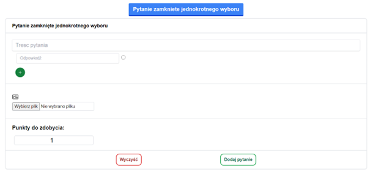
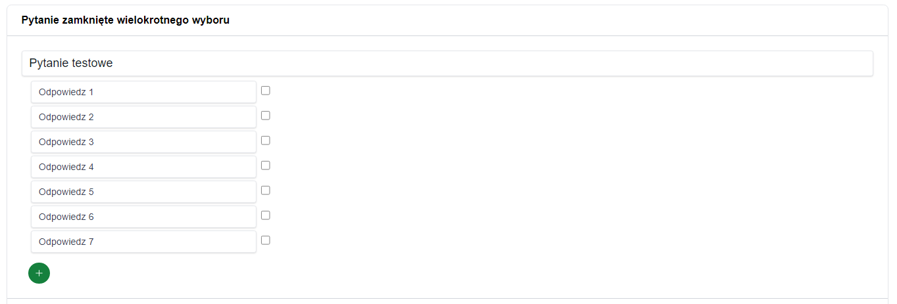
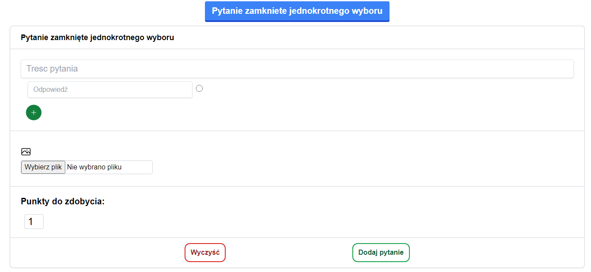
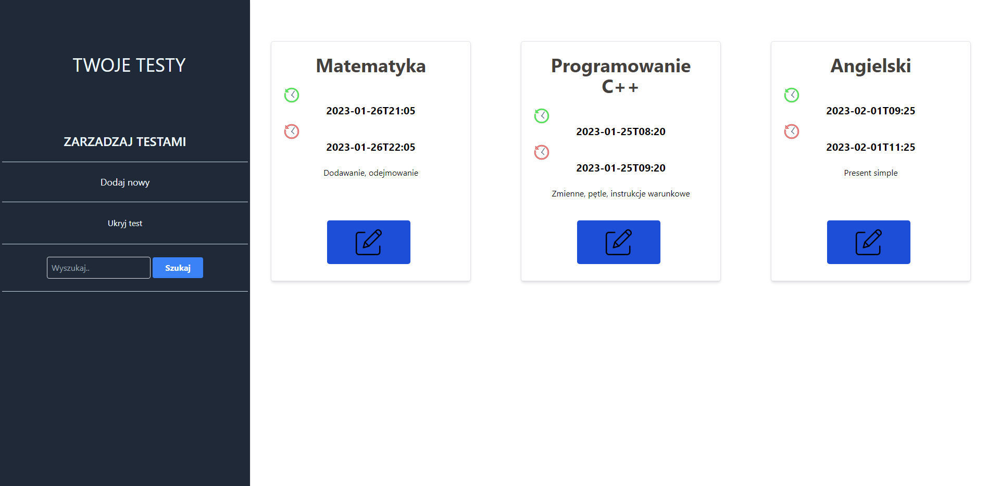
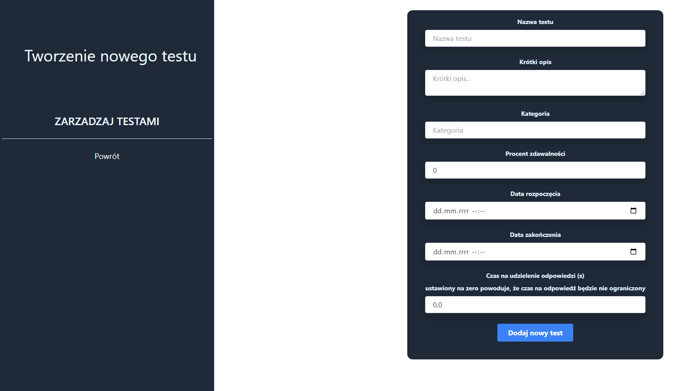

# Quiz and exam creation application

## Project description
The application is my project for my engineering thesis. 
Its main functionalities are the ability to create exams. Ability to create open-ended, closed-ended, multiple choice questions, etc. 
The application was created in the COVIDA era with the idea of supporting online knowledge testing. 
It has simple mechanisms to prevent cheating like setting the time for a question or browser tab change detection. 
The app also automatically checks closed questions, or can send an email with the results. 

## How to run?
You can run app using Docker, just download docker-compose and:

```docker-compose up```

Log in in to app with already created user: tomasz@nowak.pl Tomasz12345@ or register on your own.

### You can also setup a simple infrastructure in AWS with terraform files

Before deploying the infrastructure, you must create a custom AMI using Packer.
Packer configuration files are located in:
``terraform/packer/app.pkr.hcl``

To build the AMI, run:

``cd terraform/packer``
``packer init .``
``packer validate .``
``packer build app.pkr.hcl``

After building, copy the generated AMI ID and set it e in the root module.

To deploy the infrastructure, run the following commands:
``terraform init``
``terraform plan``
``terraform apply``

#### Infrastructure Overview
This project creates the following resources:

* A dedicated VPC

* Public and private subnets

* Internet Gateway and Route Tables

* Application Load Balancer (ALB) in public subnets

* EC2 instance in private subnets (without public IP)

* Security Groups following best practices

* Custom AMI built with Packer running a Dockerized application


## Technologies
The application is not a front-end work of art. 
The main goal of the project was to explore java language and learn nosql database MonogoDB
- **Backend**: Java + Spring Boot
- **Frontend**: Thymeleaf + TailwindCSS
- **Database**: MongoDB
- **Other**: Some Javascript to improve UX

## Some screenshots (question creator, exam managment)




